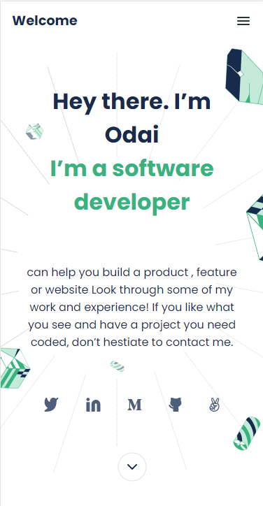

[](https://img.shields.io/badge/Microverse-blueviolet)

# Project Name

 ### Portfolio
 
 A portfolio is a collection of work samples that you can bring to an interview, send to a prospective employer, or even post online. Portfolios can: Provide evidence of work that you've done.

## Built With

- HTML & CSS

## Screenshot




## Getting Started

To get a local copy up and running follow these simple example steps.


### Prerequisites
- Download Visual Studio Code.
- Download Git.

### Install

1. Clone the repo
```sh
   git clone https://github.com/odaialazzeh/protrfolio.git
```
2. Install NPM packages
```sh
   npm install
```

### Run tests
 ```sh
    - Open it by live server in the VScode.
    - Check for the linters
 ```


## Authors

👤 **Odai**

- GitHub: [@githubhandle](https://github.com/odaialazzeh)


## 🤝 Contributing

Contributions, issues, and feature requests are welcome!

Feel free to contact me @ odai.alazzeh@gmail.com

## Show your support

Give a ⭐️ if you like this project!

## Acknowledgments

A list of resources that i find helpful and would like to give credit to :

- [Microverse ](https://www.microverse.org)
- [GitHub ](https://www.github.com)
- [Youtube ](https://www.youtube.com)
- [W3schools ](https://www.w3schools.com)
- [Stackoverflow ](https://stackoverflow.com)

## 📝 License

This project is [MIT](https://github.com/odaialazzeh/Portfolio/blob/main/LICENSE) licensed.

